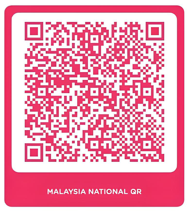

# Screen Rotate Tool（外挂）

> 作者：SongQuan  
> 平台：Windows  
> 类型：系统级屏幕控制工具 / 外挂  
> 形态：单文件 EXE（常驻系统托盘）  
> 版本：v1.0.0

---

## 📌 项目说明（为什么叫「外挂」）

本工具被定义为 **外挂**，原因如下：

- 可 **破坏 / 绕过几乎所有软件的强制全屏模式**
- 对 **全屏锁定类应用**（教学软件、会议软件、播放器等）生效
- 不依赖目标软件提供的功能
- 在 **系统层级**直接控制显示方向
- 可 **指定仅在某个程序运行时才启用**

本工具并不注入、不修改目标程序，
而是以 **系统级方式介入显示行为**。

因此，它更接近于：
> **对系统显示机制的外挂式控制**

---

## 🎯 主要用途

- 破解无法退出 / 无法旋转的强制全屏
- 教学、会议、演示、投屏场景快速调整方向
- 仅在指定程序运行时启用，避免误触
- 后台常驻、低资源占用、稳定运行

---

## ✅ 已整合功能清单

### 🔧 基础特性
- ✔ **单文件 EXE**
- ✔ **系统托盘常驻**
- ✔ **稳定运行，不 crash**
- ✔ **极低 CPU / 内存占用**

---

### 💾 设置与状态管理
- ✔ **自动保存所有设定**
- ✔ **下次启动自动还原**
- ✔ **显示当前屏幕旋转角度**
  - 旋转后弹出提示
  - 5 秒后自动消失

---

### 🖥 多显示器支持
- ✔ **多屏幕选择**
- ✔ **可指定旋转某一块屏幕**

---

### ⌨ 快捷键功能
- ✔ **Ctrl + Alt + 0**
  - 屏幕旋转 90°
  - 倒数计时
  - 自动回正

---

### 🧠 高级 / 外挂能力
- ✔ **Dev Mode（开发者模式）**
- ✔ **后台程序监视（任务管理器级）**
  - 仅当指定程序运行时快捷键才生效
  - 可指定任意 `.exe`
- ✔ **破坏强制全屏**
  - 对大多数全屏锁定软件有效

---

### 🚀 系统整合
- ✔ **开机自启动（可选开关）**
- ✔ **静默启动，不弹窗口**
- ✔ **双击 EXE 打开设置界面**

---

### ℹ 其他信息
- ✔ **内建版本号**
- ✔ **作者签名：SongQuan**

---

## ⚠ 使用说明与风险提示

- 本工具属于 **系统级行为控制工具**
- 会影响目标软件的全屏显示行为
- 请确认你的使用场景与环境允许此类操作
- 作者不对任何违规使用负责

---

## 📦 技术特性（简述）

- Windows 原生 API
- 系统级显示控制
- 非注入 / 非 Hook
- 不修改、不附加目标程序
- 无需第三方运行环境

---

## ❤️ 赞助支持（DuitNow）

如果这个工具对你有帮助，  
欢迎通过 **DuitNow QR** 支持作者的开发与维护。

> DuitNow QR 支持：
> - Touch ’n Go eWallet  
> - AIA Bank（AIA+ App）  
> - GrabPay / ShopeePay  
> - 多数马来西亚银行 App  

> 所有赞助均为自愿  
> 感谢你的支持 🙏

---

## 📝 结语

这是一个 **为了解决“系统被强制限制”而存在的工具**。  
如果你知道你在做什么，它会非常好用。

